# OVMobileBench Architecture

## Overview

OVMobileBench is an end-to-end benchmarking pipeline for OpenVINO on mobile devices. It automates the complete workflow from obtaining OpenVINO runtime, packaging models and libraries, deploying to devices, running benchmarks, and generating comprehensive reports.

## System Architecture

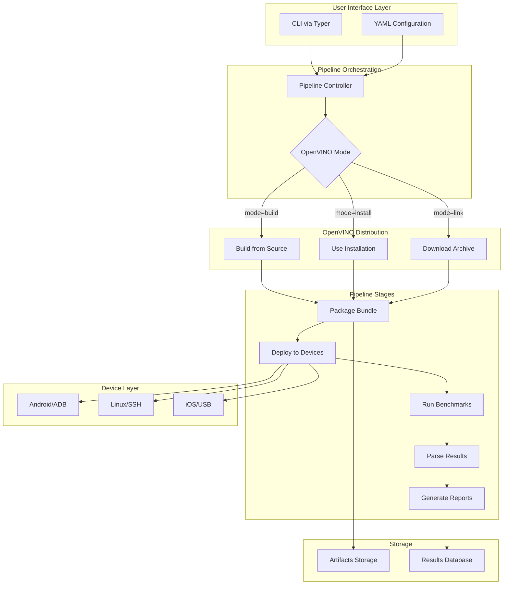

## High-Level Flow Diagram

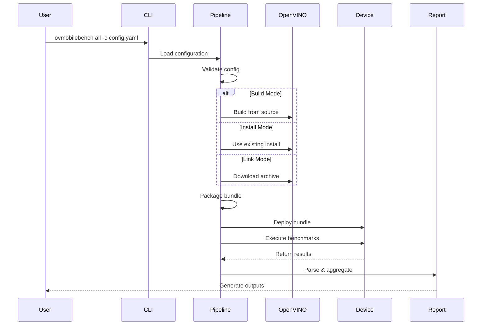

## Component Architecture

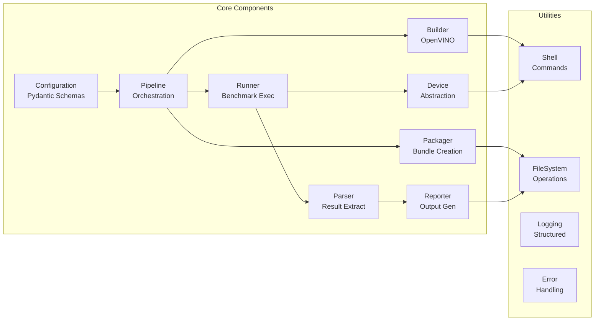

## Core Components

### 1. Configuration System (`ovmobilebench/config/`)

**Purpose**: Define and validate experiment configurations with strong typing.

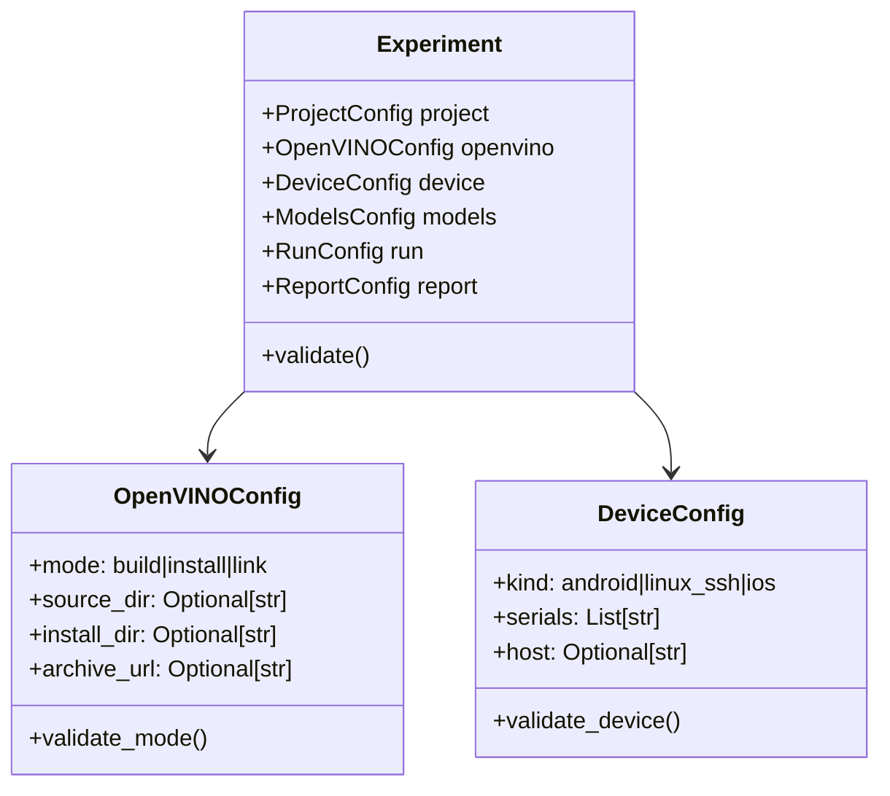

### 2. OpenVINO Distribution System

**Three flexible modes for obtaining OpenVINO runtime:**

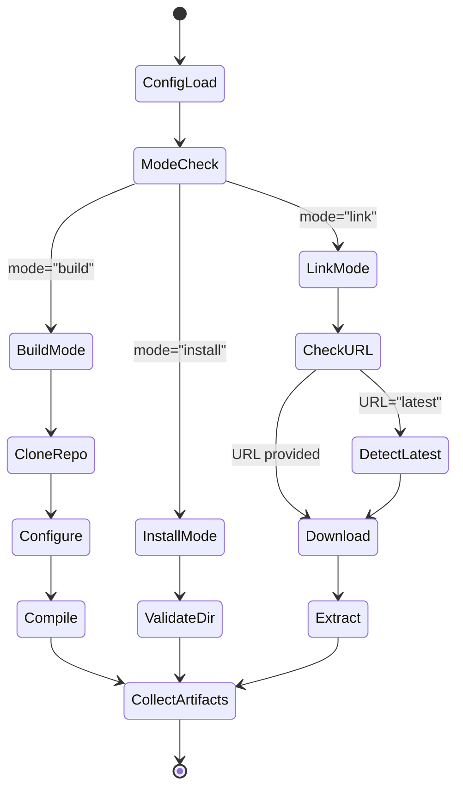

### 3. Device Abstraction Layer

**Uniform interface for different device types:**

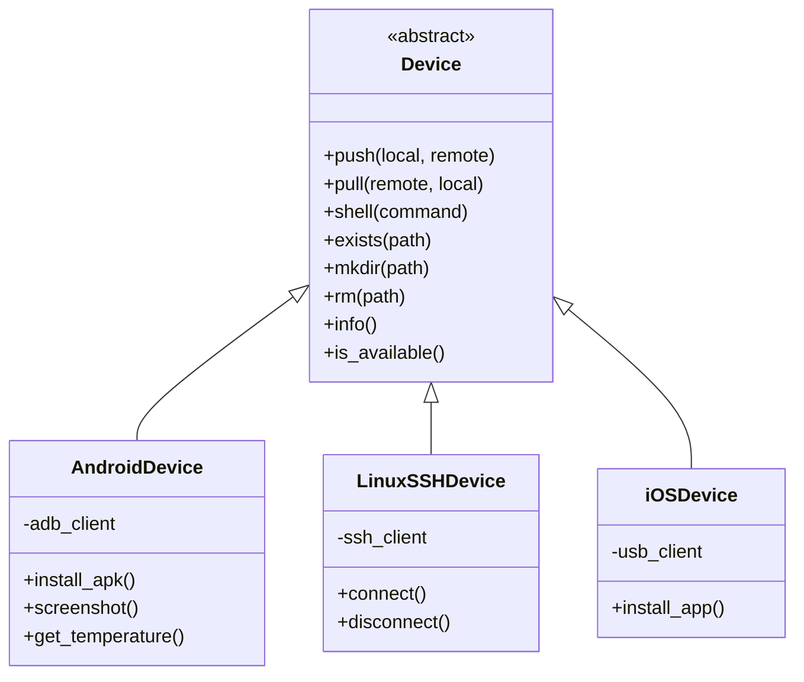

### 4. Pipeline Execution Flow

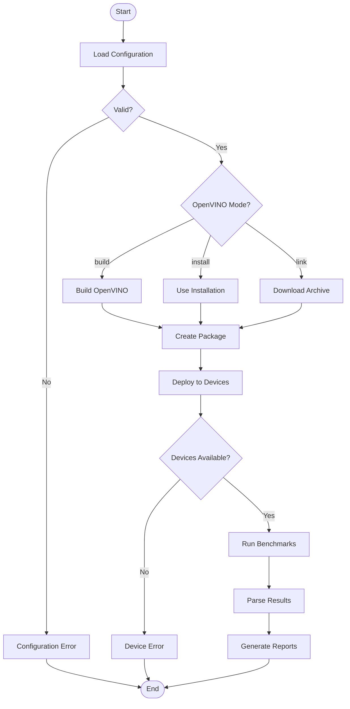

## Data Flow Architecture

### Configuration to Execution

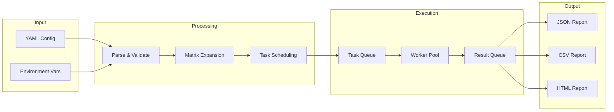

### Artifact Management

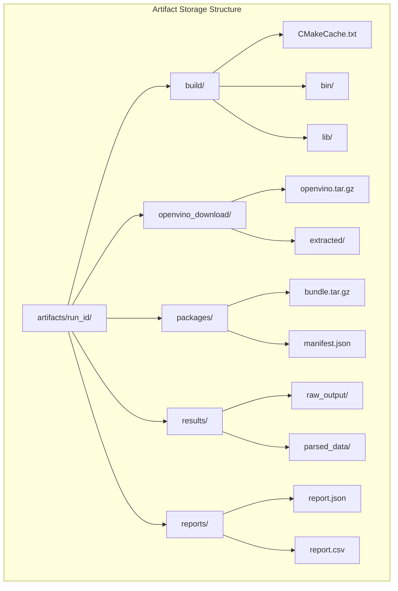

## Performance Architecture

### Parallel Execution Strategy

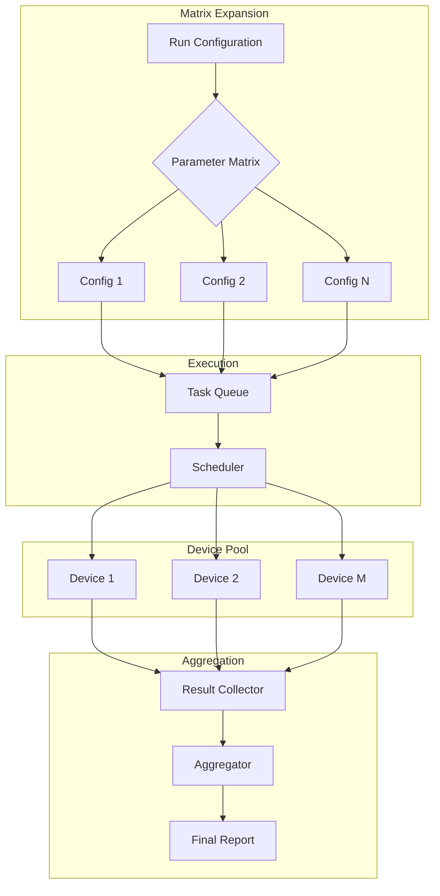

## Security Architecture

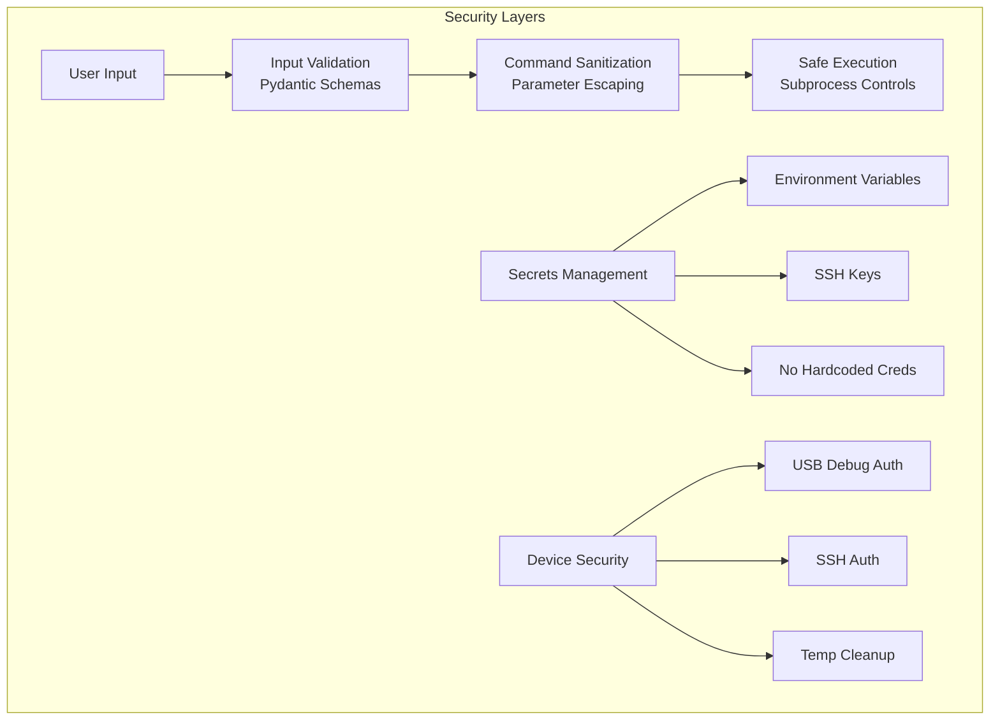

## Extensibility Architecture

### Plugin System Design

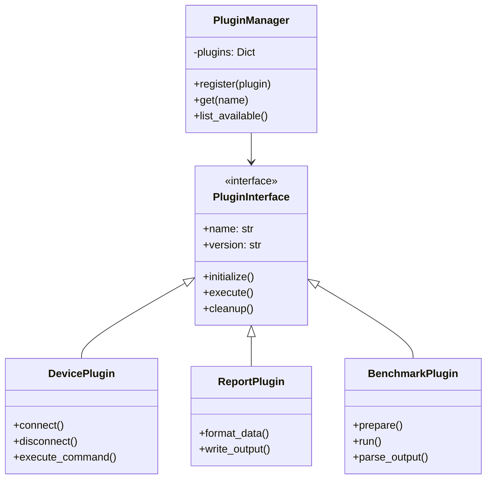

## Error Handling Architecture

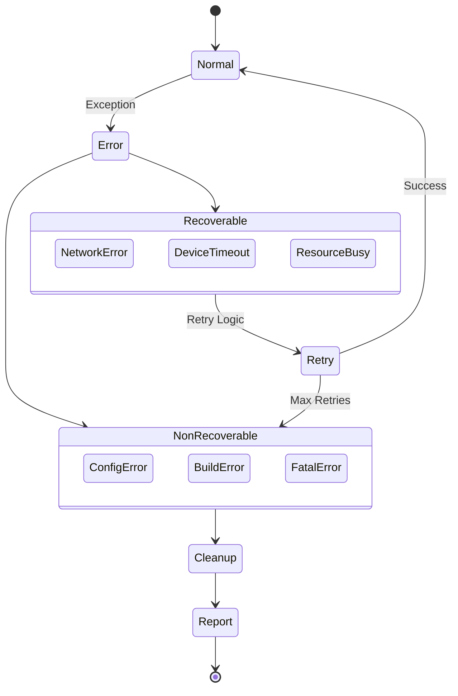

## CI/CD Integration

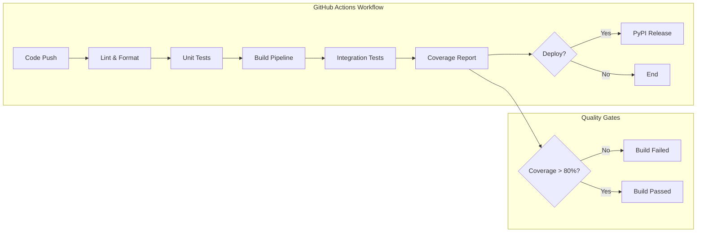

## Monitoring & Observability

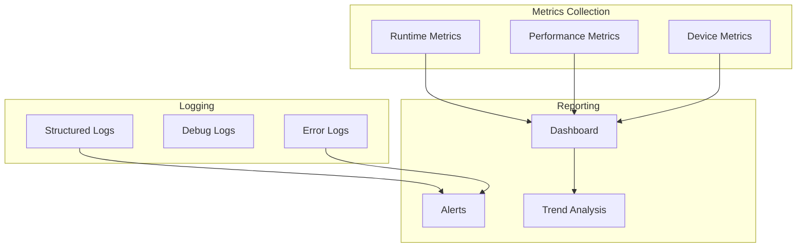

## Technology Stack

### Core Technologies

| Component | Technology | Purpose |
|-----------|------------|---------|
| Language | Python 3.11+ | Core implementation |
| CLI | Typer | Command-line interface |
| Validation | Pydantic | Configuration validation |
| Android | adbutils | Device communication |
| SSH | Paramiko | Linux device access |
| Data | Pandas | Result processing |
| Testing | Pytest | Test framework |
| Formatting | Black | Code formatting |
| Linting | Ruff | Code quality |
| Types | MyPy | Type checking |

### Build Dependencies

| Component | Version | Purpose |
|-----------|---------|---------|
| Android NDK | r26d+ | Android cross-compilation |
| CMake | 3.24+ | Build configuration |
| Ninja | 1.11+ | Build execution |
| Python | 3.11+ | Runtime requirement |

## Future Enhancements

### Roadmap

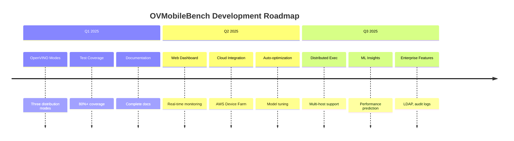

## License

Apache License 2.0 - See [LICENSE](../LICENSE) for details.
