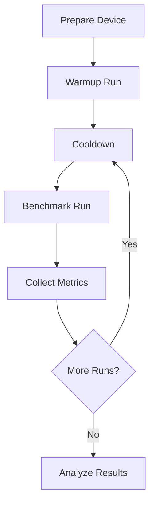

# Benchmarking Guide

This guide covers running benchmarks, interpreting results, and optimizing performance.

## Table of Contents

1. [Understanding benchmark_app](#understanding-benchmark_app)
2. [Running Benchmarks](#running-benchmarks)
3. [Benchmark Parameters](#benchmark-parameters)
4. [Performance Metrics](#performance-metrics)
5. [Optimization Strategies](#optimization-strategies)
6. [Result Analysis](#result-analysis)
7. [Best Practices](#best-practices)

## Understanding benchmark_app

### What is benchmark_app?

`benchmark_app` is OpenVINO's official tool for measuring inference performance. It:

- Loads a model and runs inference
- Measures throughput and latency
- Supports various execution modes
- Provides detailed performance metrics

### Key Concepts

- **Throughput**: Inferences per second (FPS)
- **Latency**: Time for single inference (ms)
- **Synchronous API**: Blocking, sequential execution
- **Asynchronous API**: Non-blocking, parallel execution
- **Inference Request**: Single inference operation
- **Stream**: Parallel execution pipeline

## Running Benchmarks

### Basic Benchmark

```bash
# Simple benchmark with default settings
ovmobilebench run -c experiments/basic.yaml
```

Basic configuration:

```yaml
run:
  repeats: 3
  matrix:
    niter: [100]
    api: ["sync"]
    device: ["CPU"]
    threads: [4]
```

### Advanced Benchmark

```yaml
run:
  repeats: 5
  warmup_runs: 2
  cooldown_sec: 30
  timeout_sec: 600
  matrix:
    niter: [100, 200, 500]
    api: ["sync", "async"]
    nireq: [1, 2, 4, 8]
    nstreams: ["1", "2", "AUTO"]
    device: ["CPU"]
    threads: [1, 2, 4, 8]
    infer_precision: ["FP32", "FP16", "INT8"]
```

### Running Individual Configurations

```bash
# Run specific configuration
ovmobilebench run -c experiments/config.yaml \
    --filter "threads=4,nstreams=2"
```

## Benchmark Parameters

### Core Parameters

| Parameter | Description | Values | Impact |
|-----------|-------------|--------|--------|
| `niter` | Number of iterations | 50-10000 | Higher = more accurate |
| `api` | Execution API | sync, async | Async = better throughput |
| `nireq` | Inference requests | 1-16 | More = parallel execution |
| `nstreams` | Execution streams | 1, 2, AUTO | AUTO = OpenVINO optimizes |
| `device` | Target device | CPU, GPU, NPU | Hardware selection |
| `threads` | CPU threads | 1-N cores | Parallelism level |

### Performance Hints

```yaml
run:
  matrix:
    hint: ["LATENCY", "THROUGHPUT", "CUMULATIVE_THROUGHPUT"]
```

- **LATENCY**: Optimize for minimal latency
- **THROUGHPUT**: Optimize for maximum FPS
- **CUMULATIVE_THROUGHPUT**: Multiple models simultaneously

### Precision Settings

```yaml
run:
  matrix:
    infer_precision: ["FP32", "FP16", "INT8"]
```

- **FP32**: Full precision (baseline)
- **FP16**: Half precision (2x faster, minimal accuracy loss)
- **INT8**: 8-bit integers (4x faster, requires calibration)

## Performance Metrics

### Primary Metrics

#### Throughput

```
Throughput: 156.23 FPS
```

- Total inferences per second
- Higher is better
- Best for batch processing

#### Latency

```
Latency:
  Median: 6.4 ms
  Average: 6.5 ms
  Min: 5.8 ms
  Max: 8.2 ms
```

- Time per inference
- Lower is better
- Critical for real-time applications

### Secondary Metrics

#### CPU Utilization

```bash
# Monitor during benchmark
adb shell top -d 1 | grep benchmark_app
```

#### Memory Usage

```bash
# Check memory consumption
adb shell dumpsys meminfo | grep benchmark_app
```

#### Power Consumption

```bash
# Battery stats (Android)
adb shell dumpsys batterystats
```

## Optimization Strategies

### Thread Optimization

Find optimal thread count:

```yaml
run:
  matrix:
    threads: [1, 2, 3, 4, 5, 6, 7, 8]
```

Analysis:

```python
import pandas as pd
import matplotlib.pyplot as plt

df = pd.read_csv('results.csv')
thread_perf = df.groupby('threads')['throughput_fps'].mean()
thread_perf.plot(kind='line', marker='o')
plt.xlabel('Threads')
plt.ylabel('Throughput (FPS)')
plt.title('Performance vs Thread Count')
```

### Stream Optimization

```yaml
run:
  matrix:
    nstreams: ["1", "2", "4", "AUTO"]
    nireq: [1, 2, 4, 8]
```

Best practices:

- nstreams ≤ number of CPU cores
- nireq ≥ nstreams for async mode
- Use AUTO for automatic optimization

### Batch Size Optimization

```yaml
models:
  - name: "model"
    path: "model.xml"
    batch_size: [1, 2, 4, 8, 16]

run:
  matrix:
    batch: [1, 2, 4, 8, 16]
```

Trade-offs:

- Larger batch = better throughput
- Larger batch = higher latency
- Memory constraints limit max batch

### Memory Optimization

```yaml
run:
  advanced:
    cache_dir: "/data/local/tmp/cache"
    enable_mmap: true
    memory_reuse: true
```

### CPU Affinity

```bash
# Pin to big cores (Android)
adb shell "taskset 0xF0 benchmark_app ..."

# Pin to specific cores (Linux)
taskset -c 4-7 benchmark_app ...
```

## Result Analysis

### Statistical Analysis

```python
import pandas as pd
import numpy as np

# Load results
df = pd.read_csv('results.csv')

# Group by configuration
grouped = df.groupby(['model', 'threads', 'nstreams'])

# Calculate statistics
stats = grouped['throughput_fps'].agg([
    'mean',
    'median',
    'std',
    ('cv', lambda x: x.std() / x.mean()),  # Coefficient of variation
    ('q25', lambda x: x.quantile(0.25)),
    ('q75', lambda x: x.quantile(0.75))
])

print(stats)
```

### Performance Comparison

```python
# Compare configurations
baseline = df[df['threads'] == 1]['throughput_fps'].median()

for threads in [2, 4, 8]:
    perf = df[df['threads'] == threads]['throughput_fps'].median()
    speedup = perf / baseline
    efficiency = speedup / threads
    print(f"Threads={threads}: Speedup={speedup:.2f}x, Efficiency={efficiency:.2%}")
```

### Visualization

```python
import matplotlib.pyplot as plt
import seaborn as sns

# Heatmap of performance
pivot = df.pivot_table(
    values='throughput_fps',
    index='threads',
    columns='nstreams',
    aggfunc='median'
)

plt.figure(figsize=(10, 6))
sns.heatmap(pivot, annot=True, fmt='.1f', cmap='YlOrRd')
plt.title('Performance Heatmap: Threads vs Streams')
plt.show()
```

### Regression Detection

```python
def detect_regression(current, baseline, threshold=-0.05):
    """Detect performance regression"""
    change = (current - baseline) / baseline
    if change < threshold:
        return True, change
    return False, change

# Example usage
baseline_fps = 100.0
current_fps = 92.0
is_regression, change = detect_regression(current_fps, baseline_fps)
if is_regression:
    print(f"REGRESSION: {change:.1%} drop in performance")
```

## Best Practices

### Experimental Design

1. **Control Variables**
   - Keep one parameter variable at a time
   - Document all fixed parameters
   - Record environmental conditions

2. **Statistical Validity**
   - Run at least 3 repetitions
   - Discard warmup runs
   - Use median instead of mean

3. **Fair Comparison**
   - Same model, same input
   - Same device state
   - Same thermal conditions

### Benchmark Workflow



### Configuration Examples

#### Latency-Optimized

```yaml
run:
  matrix:
    api: ["sync"]
    nireq: [1]
    nstreams: ["1"]
    hint: ["LATENCY"]
```

#### Throughput-Optimized

```yaml
run:
  matrix:
    api: ["async"]
    nireq: [8]
    nstreams: ["AUTO"]
    hint: ["THROUGHPUT"]
```

#### Power-Efficient

```yaml
run:
  matrix:
    threads: [2]  # Use efficiency cores
    nstreams: ["1"]
    device: ["CPU"]
```

### Reporting Template

```markdown
## Benchmark Report

### Configuration
- Model: ResNet-50
- Device: Snapdragon 888
- Precision: FP16
- Batch Size: 1

### Results
| Threads | Streams | Throughput (FPS) | Latency (ms) |
|---------|---------|------------------|--------------|
| 1       | 1       | 25.3            | 39.5         |
| 4       | 2       | 78.2            | 12.8         |
| 8       | AUTO    | 95.6            | 10.5         |

### Analysis
- Optimal configuration: 8 threads, AUTO streams
- Linear scaling up to 4 threads
- Diminishing returns beyond 4 threads
```

## Common Pitfalls

### Thermal Throttling

```python
# Detect thermal throttling
def detect_throttling(fps_over_time):
    """Detect performance degradation over time"""
    first_quarter = np.mean(fps_over_time[:len(fps_over_time)//4])
    last_quarter = np.mean(fps_over_time[-len(fps_over_time)//4:])

    degradation = (first_quarter - last_quarter) / first_quarter
    if degradation > 0.1:  # 10% drop
        return True, degradation
    return False, degradation
```

### Insufficient Warmup

```yaml
run:
  warmup_runs: 5  # Increase for stable results
  matrix:
    niter: [200]  # Ensure enough iterations
```

### Background Interference

```bash
# Check for background processes
adb shell ps -A | grep -v idle

# Monitor CPU frequency
adb shell "while true; do
    cat /sys/devices/system/cpu/cpu*/cpufreq/scaling_cur_freq
    sleep 1
done"
```

## Advanced Topics

### Multi-Model Benchmarking

```yaml
models:
  - name: "resnet50"
    path: "models/resnet50.xml"
  - name: "mobilenet"
    path: "models/mobilenet.xml"
  - name: "yolo"
    path: "models/yolo.xml"

run:
  multi_model_mode: "sequential"  # or "parallel"
```

### Dynamic Shapes

```yaml
models:
  - name: "model"
    path: "model.xml"
    dynamic_shapes:
      input: [1, 3, -1, -1]  # Dynamic H, W

run:
  matrix:
    input_shape:
      - [1, 3, 224, 224]
      - [1, 3, 416, 416]
      - [1, 3, 640, 640]
```

### Custom Metrics

```python
def calculate_efficiency_metrics(df):
    """Calculate custom efficiency metrics"""
    metrics = {}

    # FPS per thread
    metrics['fps_per_thread'] = df['throughput_fps'] / df['threads']

    # FPS per watt (if power data available)
    if 'power_w' in df.columns:
        metrics['fps_per_watt'] = df['throughput_fps'] / df['power_w']

    # Latency consistency
    if 'latency_std' in df.columns:
        metrics['latency_cv'] = df['latency_std'] / df['latency_avg']

    return pd.DataFrame(metrics)
```

## Troubleshooting

### Low Performance

1. Check thermal state
2. Verify CPU frequency
3. Ensure proper thread affinity
4. Check memory availability
5. Verify model optimization

### Inconsistent Results

1. Increase warmup runs
2. Add cooldown periods
3. Disable background apps
4. Use performance governor
5. Pin CPU frequency

### Crashes/Errors

1. Check memory limits
2. Verify model compatibility
3. Reduce batch size
4. Check library dependencies
5. Review device logs

## Next Steps

- [CI/CD Integration](ci-cd.md) - Automated benchmarking
- [API Reference](api-reference.md) - Programming interface
- [Troubleshooting](troubleshooting.md) - Common issues
