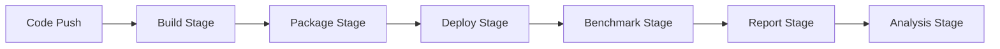

# CI/CD Integration Guide

This guide covers integrating OVMobileBench into continuous integration and deployment pipelines.

## Table of Contents

1. [Overview](#overview)
2. [GitHub Actions](#github-actions)
3. [GitLab CI](#gitlab-ci)
4. [Jenkins](#jenkins)
5. [Self-Hosted Runners](#self-hosted-runners)
6. [Automated Testing](#automated-testing)
7. [Performance Tracking](#performance-tracking)
8. [Best Practices](#best-practices)

## Overview

### CI/CD Benefits

- **Automated builds**: Build OpenVINO on every commit
- **Regression detection**: Catch performance drops early
- **Device testing**: Run on real hardware automatically
- **Reproducibility**: Consistent test environment
- **Historical tracking**: Monitor performance over time

### Pipeline Architecture



## GitHub Actions

### Basic Workflow

`.github/workflows/benchmark.yml`:
```yaml
name: Benchmark Pipeline

on:
  push:
    branches: [main, develop]
  pull_request:
    branches: [main]
  schedule:
    - cron: '0 2 * * *'  # Nightly at 2 AM

jobs:
  build:
    runs-on: ubuntu-latest
    steps:
      - uses: actions/checkout@v4
      
      - name: Setup Python
        uses: actions/setup-python@v5
        with:
          python-version: '3.11'
      
      - name: Install OVMobileBench
        run: |
          pip install -e .[dev]
      
      - name: Build OpenVINO
        run: |
          ovmobilebench build -c ci/config.yaml
      
      - name: Upload artifacts
        uses: actions/upload-artifact@v4
        with:
          name: ovbundle
          path: artifacts/
          retention-days: 7

  benchmark:
    needs: build
    runs-on: [self-hosted, android]
    steps:
      - uses: actions/checkout@v4
      
      - name: Download artifacts
        uses: actions/download-artifact@v4
        with:
          name: ovbundle
          path: artifacts/
      
      - name: Run benchmarks
        run: |
          ovmobilebench deploy -c ci/config.yaml
          ovmobilebench run -c ci/config.yaml
          ovmobilebench report -c ci/config.yaml
      
      - name: Upload results
        uses: actions/upload-artifact@v4
        with:
          name: results
          path: results/
```

### Matrix Testing

```yaml
name: Matrix Benchmark

jobs:
  benchmark:
    strategy:
      matrix:
        device: [pixel6, galaxy-s21, oneplus9]
        precision: [FP32, FP16, INT8]
        threads: [1, 4, 8]
    
    runs-on: [self-hosted, "${{ matrix.device }}"]
    
    steps:
      - name: Run benchmark
        env:
          DEVICE: ${{ matrix.device }}
          PRECISION: ${{ matrix.precision }}
          THREADS: ${{ matrix.threads }}
        run: |
          ovmobilebench run -c ci/matrix.yaml \
            --override "run.matrix.threads=[$THREADS]" \
            --override "run.matrix.infer_precision=[\"$PRECISION\"]"
```

### PR Benchmarking

```yaml
name: PR Performance Check

on:
  pull_request:
    types: [opened, synchronize]

jobs:
  benchmark-pr:
    runs-on: [self-hosted, android]
    steps:
      - name: Checkout PR
        uses: actions/checkout@v4
      
      - name: Checkout main
        uses: actions/checkout@v4
        with:
          ref: main
          path: baseline
      
      - name: Run PR benchmark
        run: |
          ovmobilebench all -c ci/pr.yaml -o results/pr.json
      
      - name: Run baseline benchmark
        run: |
          cd baseline
          ovmobilebench all -c ci/pr.yaml -o results/baseline.json
      
      - name: Compare results
        id: compare
        run: |
          python ci/compare.py \
            --baseline results/baseline.json \
            --current results/pr.json \
            --threshold -5.0
      
      - name: Comment on PR
        uses: actions/github-script@v7
        with:
          script: |
            github.rest.issues.createComment({
              issue_number: context.issue.number,
              owner: context.repo.owner,
              repo: context.repo.repo,
              body: `${{ steps.compare.outputs.report }}`
            })
```

### Nightly Benchmarks

```yaml
name: Nightly Performance

on:
  schedule:
    - cron: '0 2 * * *'

jobs:
  nightly:
    runs-on: [self-hosted, android]
    steps:
      - uses: actions/checkout@v4
      
      - name: Full benchmark suite
        run: |
          ovmobilebench all -c ci/nightly.yaml
      
      - name: Upload to dashboard
        run: |
          python ci/upload_dashboard.py \
            --results results/ \
            --endpoint $PERF_DASHBOARD_URL
      
      - name: Check regressions
        run: |
          python ci/check_regression.py \
            --current results/latest.json \
            --baseline baselines/weekly.json \
            --notify-slack
```

## GitLab CI

### Basic Pipeline

`.gitlab-ci.yml`:
```yaml
stages:
  - build
  - package
  - deploy
  - benchmark
  - report

variables:
  OVBENCH_CONFIG: "ci/gitlab.yaml"

build:openvino:
  stage: build
  image: ubuntu:22.04
  before_script:
    - apt-get update && apt-get install -y cmake ninja-build
  script:
    - ovmobilebench build -c $OVBENCH_CONFIG
  artifacts:
    paths:
      - artifacts/
    expire_in: 1 week

package:bundle:
  stage: package
  dependencies:
    - build:openvino
  script:
    - ovmobilebench package -c $OVBENCH_CONFIG
  artifacts:
    paths:
      - bundles/

benchmark:android:
  stage: benchmark
  tags:
    - android-runner
  dependencies:
    - package:bundle
  script:
    - ovmobilebench deploy -c $OVBENCH_CONFIG
    - ovmobilebench run -c $OVBENCH_CONFIG
  artifacts:
    paths:
      - results/
    reports:
      junit: results/junit.xml

report:performance:
  stage: report
  dependencies:
    - benchmark:android
  script:
    - ovmobilebench report -c $OVBENCH_CONFIG
    - python ci/generate_report.py
  artifacts:
    paths:
      - reports/
    reports:
      performance: reports/performance.json
```

### Merge Request Pipeline

```yaml
benchmark:mr:
  stage: benchmark
  only:
    - merge_requests
  script:
    - |
      # Run benchmarks
      ovmobilebench all -c ci/mr.yaml
      
      # Compare with target branch
      git checkout $CI_MERGE_REQUEST_TARGET_BRANCH_NAME
      ovmobilebench all -c ci/mr.yaml -o baseline.json
      
      # Generate comparison
      python ci/compare.py --format markdown > comparison.md
      
      # Post comment
      curl -X POST \
        -H "PRIVATE-TOKEN: $CI_JOB_TOKEN" \
        "$CI_API_V4_URL/projects/$CI_PROJECT_ID/merge_requests/$CI_MERGE_REQUEST_IID/notes" \
        -d "body=$(cat comparison.md)"
```

## Jenkins

### Jenkinsfile

```groovy
pipeline {
    agent any
    
    environment {
        ANDROID_SERIAL = credentials('android-device-serial')
        OVBENCH_CONFIG = 'ci/jenkins.yaml'
    }
    
    stages {
        stage('Build') {
            agent {
                docker {
                    image 'ovmobilebench/build:latest'
                }
            }
            steps {
                sh 'ovmobilebench build -c $OVBENCH_CONFIG'
                stash includes: 'artifacts/**', name: 'build-artifacts'
            }
        }
        
        stage('Package') {
            steps {
                unstash 'build-artifacts'
                sh 'ovmobilebench package -c $OVBENCH_CONFIG'
                stash includes: 'bundles/**', name: 'bundles'
            }
        }
        
        stage('Benchmark') {
            agent {
                label 'android-device'
            }
            steps {
                unstash 'bundles'
                sh '''
                    ovmobilebench deploy -c $OVBENCH_CONFIG
                    ovmobilebench run -c $OVBENCH_CONFIG
                    ovmobilebench report -c $OVBENCH_CONFIG
                '''
            }
        }
        
        stage('Analysis') {
            steps {
                publishHTML([
                    reportDir: 'reports',
                    reportFiles: 'index.html',
                    reportName: 'Performance Report'
                ])
                
                perfReport(
                    sourceDataFiles: 'results/*.json',
                    compareBuildPrevious: true,
                    modePerformancePerTestCase: true
                )
            }
        }
    }
    
    post {
        always {
            archiveArtifacts artifacts: 'results/**', fingerprint: true
        }
        regression {
            emailext(
                subject: 'Performance Regression Detected',
                body: '${FILE,path="reports/regression.txt"}',
                to: 'nesterov.alexander@outlook.com'
            )
        }
    }
}
```

### Parameterized Builds

```groovy
pipeline {
    parameters {
        choice(name: 'DEVICE', choices: ['pixel6', 'galaxy-s21'], description: 'Target device')
        choice(name: 'PRECISION', choices: ['FP32', 'FP16', 'INT8'], description: 'Inference precision')
        string(name: 'THREADS', defaultValue: '4', description: 'Number of threads')
    }
    
    stages {
        stage('Benchmark') {
            steps {
                script {
                    def config = readYaml file: 'ci/template.yaml'
                    config.device.serials = [params.DEVICE]
                    config.run.matrix.threads = [params.THREADS as Integer]
                    config.run.matrix.infer_precision = [params.PRECISION]
                    writeYaml file: 'ci/dynamic.yaml', data: config
                }
                sh 'ovmobilebench all -c ci/dynamic.yaml'
            }
        }
    }
}
```

## Self-Hosted Runners

### GitHub Actions Runner Setup

#### Installation
```bash
# Download runner
mkdir actions-runner && cd actions-runner
curl -o actions-runner-linux-x64-2.311.0.tar.gz -L \
  https://github.com/actions/runner/releases/download/v2.311.0/actions-runner-linux-x64-2.311.0.tar.gz
tar xzf actions-runner-linux-x64-2.311.0.tar.gz

# Configure
./config.sh --url https://github.com/OWNER/REPO \
  --token YOUR_TOKEN \
  --labels android,arm64 \
  --name android-runner-1

# Install as service
sudo ./svc.sh install
sudo ./svc.sh start
```

#### Runner Configuration
```yaml
# .github/workflows/device-test.yml
jobs:
  test:
    runs-on: [self-hosted, android, arm64]
    steps:
      - name: Device check
        run: |
          adb devices
          adb shell getprop ro.product.model
```

### Device Farm Management

#### Device Registry
```yaml
# devices/inventory.yaml
devices:
  - id: pixel6-01
    serial: R3CN30XXXX
    model: Pixel 6
    soc: Google Tensor
    labels: [android, arm64, tensor]
    
  - id: galaxy-s21-01
    serial: RF8N1234567
    model: Galaxy S21
    soc: Snapdragon 888
    labels: [android, arm64, snapdragon]
```

#### Health Monitoring
```python
# ci/device_health.py
import subprocess
import yaml
import time

def check_device_health(serial):
    """Check if device is healthy"""
    try:
        # Check ADB connection
        result = subprocess.run(
            f"adb -s {serial} shell echo OK",
            shell=True, capture_output=True, timeout=5
        )
        if result.returncode != 0:
            return False, "ADB connection failed"
        
        # Check temperature
        temp = subprocess.run(
            f"adb -s {serial} shell cat /sys/class/thermal/thermal_zone0/temp",
            shell=True, capture_output=True
        )
        temp_c = int(temp.stdout) / 1000
        if temp_c > 45:
            return False, f"Temperature too high: {temp_c}°C"
        
        # Check battery
        battery = subprocess.run(
            f"adb -s {serial} shell dumpsys battery | grep level",
            shell=True, capture_output=True
        )
        level = int(battery.stdout.split(':')[1])
        if level < 20:
            return False, f"Battery too low: {level}%"
        
        return True, "Healthy"
    except Exception as e:
        return False, str(e)

# Monitor all devices
with open('devices/inventory.yaml') as f:
    devices = yaml.safe_load(f)['devices']

for device in devices:
    healthy, status = check_device_health(device['serial'])
    print(f"{device['id']}: {status}")
    if not healthy:
        # Mark device as unavailable
        subprocess.run(f"gh api /repos/OWNER/REPO/actions/runners/{device['id']}/labels -X DELETE", shell=True)
```

## Automated Testing

### Unit Tests in CI

```yaml
test:
  stage: test
  script:
    - pytest tests/ --cov=ovmobilebench --cov-report=xml
    - mypy ovmobilebench --strict
    - ruff check ovmobilebench
    - black --check ovmobilebench
  coverage: '/TOTAL.*\s+(\d+%)$/'
```

### Integration Tests

```yaml
integration:
  stage: test
  services:
    - android-emulator:latest
  script:
    - |
      # Wait for emulator
      adb wait-for-device
      
      # Run integration tests
      pytest tests/integration/ -v
```

### Performance Tests

```python
# tests/test_performance.py
import pytest
from ovmobilebench import pipeline

@pytest.mark.benchmark
def test_baseline_performance():
    """Test that performance meets baseline"""
    config = load_config('tests/baseline.yaml')
    results = pipeline.run(config)
    
    assert results['throughput_fps'] > 50.0
    assert results['latency_avg_ms'] < 20.0

@pytest.mark.parametrize('threads', [1, 2, 4, 8])
def test_thread_scaling(threads):
    """Test thread scaling efficiency"""
    config = load_config('tests/scaling.yaml')
    config['run']['matrix']['threads'] = [threads]
    
    results = pipeline.run(config)
    efficiency = results['throughput_fps'] / (threads * baseline_fps)
    
    assert efficiency > 0.7  # At least 70% scaling efficiency
```

## Performance Tracking

### Metrics Collection

```python
# ci/collect_metrics.py
import json
import time
from datetime import datetime

def collect_metrics(results_path, metadata):
    """Collect and format metrics for tracking"""
    with open(results_path) as f:
        results = json.load(f)
    
    metrics = {
        'timestamp': datetime.utcnow().isoformat(),
        'commit': metadata['commit'],
        'branch': metadata['branch'],
        'pr': metadata.get('pr_number'),
        'results': results,
        'environment': {
            'device': metadata['device'],
            'os': metadata['os'],
            'ndk_version': metadata['ndk_version']
        }
    }
    
    return metrics

# Send to time-series database
def send_to_influxdb(metrics):
    from influxdb import InfluxDBClient
    
    client = InfluxDBClient('127.0.0.1', 8086, database='ovmobilebench')
    
    points = []
    for result in metrics['results']:
        points.append({
            'measurement': 'benchmark',
            'tags': {
                'model': result['model'],
                'device': result['device'],
                'precision': result['precision'],
                'commit': metrics['commit'][:8]
            },
            'fields': {
                'throughput_fps': result['throughput_fps'],
                'latency_avg_ms': result['latency_avg_ms']
            },
            'time': metrics['timestamp']
        })
    
    client.write_points(points)
```

### Dashboard Integration

```yaml
# Grafana dashboard config
dashboard:
  title: "OVMobileBench Performance"
  panels:
    - title: "Throughput Over Time"
      query: |
        SELECT mean("throughput_fps") 
        FROM "benchmark" 
        WHERE $timeFilter 
        GROUP BY time($interval), "model"
    
    - title: "Latency Distribution"
      query: |
        SELECT percentile("latency_avg_ms", 50) as median,
               percentile("latency_avg_ms", 95) as p95,
               percentile("latency_avg_ms", 99) as p99
        FROM "benchmark"
        WHERE $timeFilter
        GROUP BY "model"
```

### Regression Detection

```python
# ci/detect_regression.py
import numpy as np
from scipy import stats

def detect_regression(baseline_data, current_data, threshold=0.05):
    """Detect performance regression using statistical test"""
    regressions = []
    
    for metric in ['throughput_fps', 'latency_avg_ms']:
        baseline = [r[metric] for r in baseline_data]
        current = [r[metric] for r in current_data]
        
        # Perform t-test
        t_stat, p_value = stats.ttest_ind(baseline, current)
        
        # Check if significant difference
        if p_value < threshold:
            baseline_mean = np.mean(baseline)
            current_mean = np.mean(current)
            change = (current_mean - baseline_mean) / baseline_mean
            
            # For throughput, decrease is regression
            # For latency, increase is regression
            if (metric == 'throughput_fps' and change < -0.05) or \
               (metric == 'latency_avg_ms' and change > 0.05):
                regressions.append({
                    'metric': metric,
                    'baseline': baseline_mean,
                    'current': current_mean,
                    'change': change,
                    'p_value': p_value
                })
    
    return regressions
```

## Best Practices

### CI Configuration

1. **Resource Management**
   ```yaml
   jobs:
     benchmark:
       timeout-minutes: 60
       continue-on-error: false
       max-parallel: 2  # Limit parallel device usage
   ```

2. **Caching**
   ```yaml
   - name: Cache build
     uses: actions/cache@v3
     with:
       path: |
         ~/.cache/ccache
         build/
       key: ${{ runner.os }}-build-${{ hashFiles('**/CMakeLists.txt') }}
   ```

3. **Artifact Management**
   ```yaml
   - uses: actions/upload-artifact@v4
     with:
       name: results-${{ github.sha }}
       path: results/
       retention-days: 30
       compression-level: 9
   ```

### Security

1. **Secrets Management**
   ```yaml
   env:
     ANDROID_KEYSTORE: ${{ secrets.ANDROID_KEYSTORE }}
     API_KEY: ${{ secrets.PERFORMANCE_API_KEY }}
   ```

2. **Access Control**
   ```yaml
   jobs:
     deploy:
       if: github.ref == 'refs/heads/main'
       environment: production
   ```

### Monitoring

1. **Job Status Notification**
   ```yaml
   - name: Notify Team
     if: failure()
     uses: 8398a7/action-slack@v3
     with:
       status: ${{ job.status }}
       text: 'Benchmark failed for ${{ github.sha }}'
   ```

2. **Performance Alerts**
   ```python
   if regression_detected:
       send_alert(
           channel='#performance',
           message=f'Regression detected: {regression_details}'
       )
   ```

### Documentation

1. **CI Documentation**
   ```markdown
   ## CI/CD Pipeline
   
   ### Triggers
   - Push to main: Full benchmark suite
   - Pull request: Quick validation
   - Nightly: Extended testing
   
   ### Required Secrets
   - ANDROID_SERIAL: Device identifier
   - PERF_API_KEY: Dashboard API key
   ```

2. **Runbook**
   ```markdown
   ## Troubleshooting CI Failures
   
   ### Device Offline
   1. SSH to runner machine
   2. Run `adb devices`
   3. Restart ADB: `adb kill-server && adb start-server`
   
   ### Build Failure
   1. Check NDK version
   2. Clear cache
   3. Review CMake logs
   ```

## Next Steps

- [API Reference](api-reference.md) - Programming interface
- [Troubleshooting](troubleshooting.md) - Common CI/CD issues
- [Architecture](architecture.md) - System design